# Preprocessing and clustering

This analysis performed based on [Scanpy tutorial](https://scanpy-tutorials.readthedocs.io/en/latest/pbmc3k.html). In this code we saved the tutorial authors notes in md-cells and code. 

The executable notebook is called `citeseq_rna_counts_analysis.ipynb`


```python
import pandas as pd
import scanpy as sc
import kaggle
import matplotlib.pyplot as plt
```

```python
sc.settings.verbosity = 3  # verbosity: errors (0), warnings (1), info (2), hints (3)
sc.logging.print_header()
sc.settings.set_figure_params(dpi=80, facecolor="white")
```


```python
dataset = "alexandervc/citeseq-scrnaseq-proteins-human-pbmcs-2019"
kaggle.api.dataset_download_files(dataset, path="./data", unzip=True)
```

    Dataset URL: https://www.kaggle.com/datasets/alexandervc/citeseq-scrnaseq-proteins-human-pbmcs-2019


```python
results_file = "write/pbmc3k.h5ad"  # the file that will store the analysis results
```

Read in the count matrix into an [AnnData](https://anndata.readthedocs.io/en/latest/anndata.AnnData.html) object, which holds many slots for annotations and different representations of the data. It also comes with its own HDF5-based file format: `.h5ad`.


```python
adata = sc.read_csv(
    'data/GSM3681518_MNC_RNA_counts.tsv/citeseq_rna_counts.tsv',
    delimiter="\t",
    first_column_names=True
)
```


```python
adata = adata.T
adata
```


    AnnData object with n_obs × n_vars = 33454 × 17009


```python
adata.var_names_make_unique()  # this is unnecessary if using `var_names='gene_ids'` in `sc.read_10x_mtx`
```


```python
adata
```


    AnnData object with n_obs × n_vars = 33454 × 17009


## Preprocessing

Show those genes that yield the highest fraction of counts in each single cell, across all cells.


```python
sc.pl.highest_expr_genes(adata, n_top=20)
```

    normalizing counts per cell
        finished (0:00:04)


    
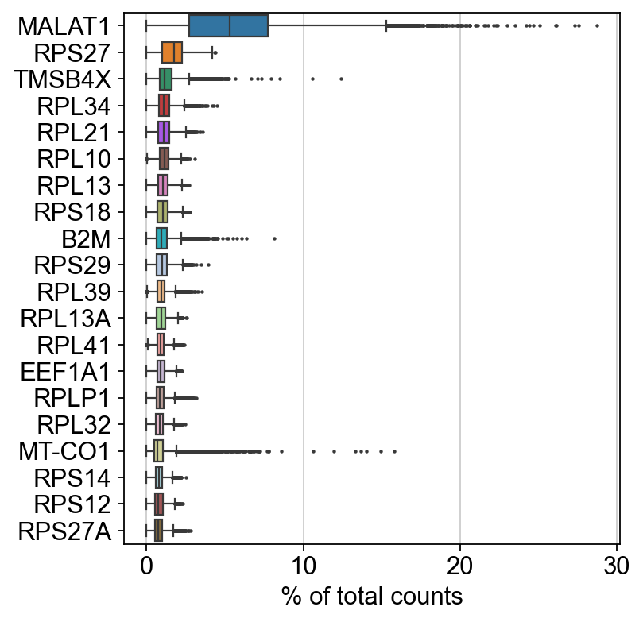
    


Basic filtering:


```python
print("Cells before:", adata.shape[0])
sc.pp.filter_cells(adata, min_genes=200)
sc.pp.filter_genes(adata, min_cells=3)
print("Cells after:", adata.shape[0])
```

    Cells before: 33454
    filtered out 6 cells that have less than 200 genes expressed
    filtered out 1 genes that are detected in less than 3 cells
    Cells after: 33448


Let's assemble some information about mitochondrial genes, which are important for quality control.

Citing from "Simple Single Cell" workflows [(Lun, McCarthy & Marioni, 2017)](https://master.bioconductor.org/packages/release/workflows/html/simpleSingleCell.html#examining-gene-level-metrics):

> High proportions are indicative of poor-quality cells (Islam et al. 2014; Ilicic et al. 2016), possibly because of loss of cytoplasmic RNA from perforated cells. The reasoning is that mitochondria are larger than individual transcript molecules and less likely to escape through tears in the cell membrane.

With `pp.calculate_qc_metrics`, we can compute many metrics very efficiently.


```python
# annotate the group of mitochondrial genes as "mt"
adata.var["mt"] = adata.var_names.str.startswith("MT-")
sc.pp.calculate_qc_metrics(
    adata, qc_vars=["mt"], percent_top=None, log1p=False, inplace=True
)
```

A violin plot of some of the computed quality measures:

* the number of genes expressed in the count matrix
* the total counts per cell
* the percentage of counts in mitochondrial genes


```python
sc.pl.violin(
    adata,
    ["n_genes_by_counts", "total_counts", "pct_counts_mt"],
    jitter=0.4,
    multi_panel=True,
)
```


    
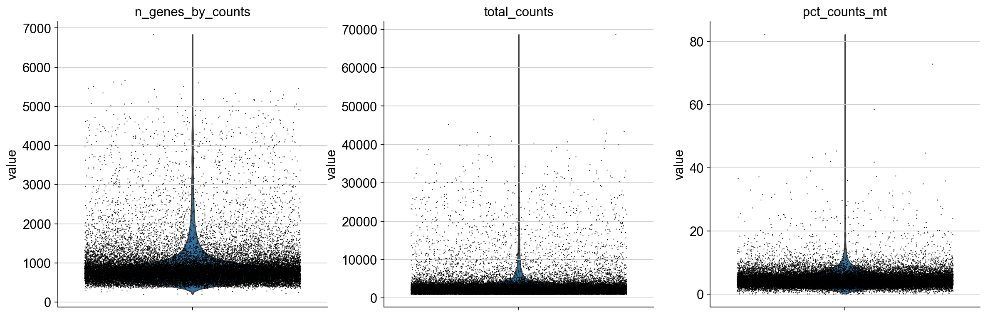
    


Remove cells that have too many mitochondrial genes expressed or too many total counts:


```python
sc.pl.scatter(adata, x="total_counts", y="pct_counts_mt")
sc.pl.scatter(adata, x="total_counts", y="n_genes_by_counts")
```


    
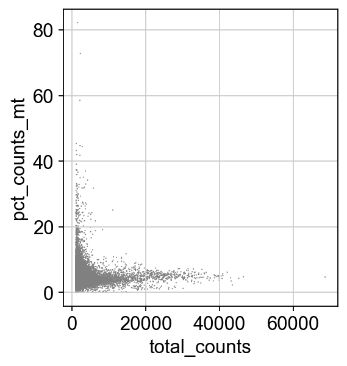
    


    
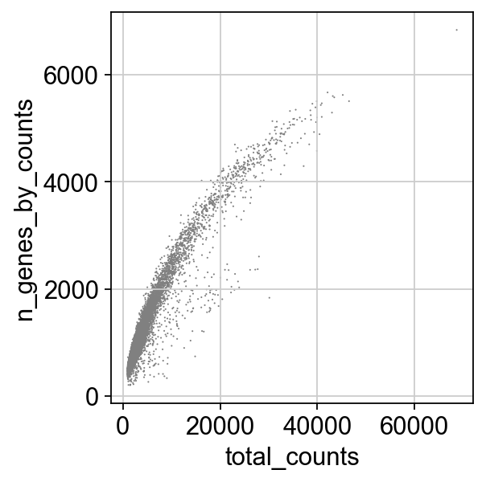
    


Actually do the filtering by slicing the `AnnData` object.


```python
adata = adata[adata.obs.n_genes_by_counts < 2500, :]
adata = adata[adata.obs.pct_counts_mt < 5, :].copy()
```

Total-count normalize (library-size correct) the data matrix $\mathbf{X}$ to 10,000 reads per cell, so that counts become comparable among cells.


```python
sc.pp.normalize_total(adata, target_sum=1e4)
```

    normalizing counts per cell
        finished (0:00:00)


Logarithmize the data:


```python
sc.pp.log1p(adata)
```

Identify highly-variable genes.


```python
sc.pp.highly_variable_genes(adata, min_mean=0.0125, max_mean=3, min_disp=0.5)
```

    extracting highly variable genes
        finished (0:00:07)
    --> added
        'highly_variable', boolean vector (adata.var)
        'means', float vector (adata.var)
        'dispersions', float vector (adata.var)
        'dispersions_norm', float vector (adata.var)


```python
sc.pl.highly_variable_genes(adata)
```


    
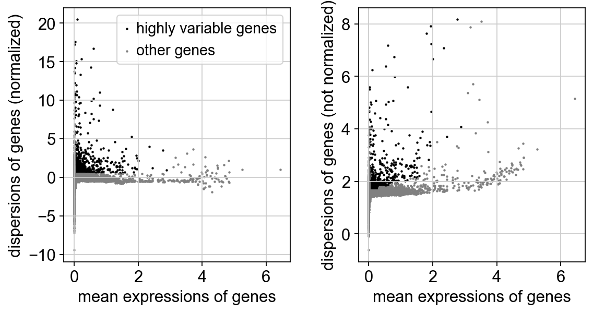
    


Set the `.raw` attribute of the AnnData object to the normalized and logarithmized raw gene expression for later use in differential testing and visualizations of gene expression. This simply freezes the state of the AnnData object.

:::{note}
You can get back an `AnnData` of the object in `.raw` by calling `.raw.to_adata()`.
:::


```python
adata.raw = adata.copy()
```

:::{note}
If you don't proceed below with correcting the data with `sc.pp.regress_out` and scaling it via `sc.pp.scale`, you can also get away without using `.raw` at all.

The result of the previous highly-variable-genes detection is stored as an annotation in `.var.highly_variable` and auto-detected by PCA and hence, `sc.pp.neighbors` and subsequent manifold/graph tools. In that case, the step *actually do the filtering* below is unnecessary, too.
:::

Actually do the filtering


```python
adata = adata[:, adata.var.highly_variable]
```

Regress out effects of total counts per cell and the percentage of mitochondrial genes expressed. Scale the data to unit variance.


```python
sc.pp.regress_out(adata, ["total_counts", "pct_counts_mt"])
```

    regressing out ['total_counts', 'pct_counts_mt']


    /Users/venikkus/miniconda3/lib/python3.11/site-packages/scanpy/preprocessing/_simple.py:710: UserWarning: Received a view of an AnnData. Making a copy.
      view_to_actual(adata)


        finished (0:00:03)


    OMP: Info #276: omp_set_nested routine deprecated, please use omp_set_max_active_levels instead.


Scale each gene to unit variance. Clip values exceeding standard deviation 10. 


```python
sc.pp.scale(adata, max_value=10)
```

## Principal component analysis

Reduce the dimensionality of the data by running principal component analysis (PCA), which reveals the main axes of variation and denoises the data.


```python
sc.tl.pca(adata, svd_solver="arpack")
```

    computing PCA
        with n_comps=50
        finished (0:00:04)


We can make a scatter plot in the PCA coordinates, but we will not use that later on.


```python
sc.pl.pca(adata, color="CST3")
```


    
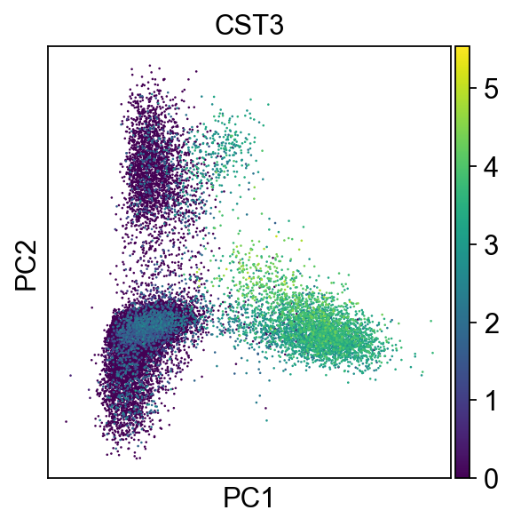
    


Let us inspect the contribution of single PCs to the total variance in the data. This gives us information about how many PCs we should consider in order to compute the neighborhood relations of cells, e.g. used in the clustering function  `sc.tl.louvain()` or tSNE `sc.tl.tsne()`. In our experience, often a rough estimate of the number of PCs does fine.


```python
sc.pl.pca_variance_ratio(adata, log=True)
```


    
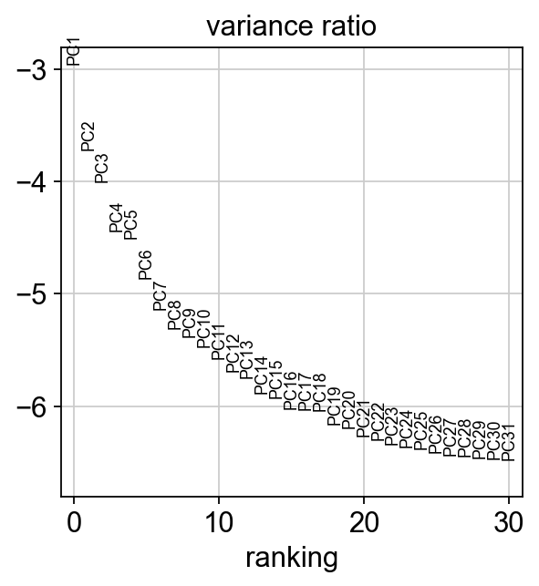
    


Save the result.


```python
adata.write(results_file)
```


```python
adata
```


    AnnData object with n_obs × n_vars = 21839 × 1063
        obs: 'n_genes', 'n_genes_by_counts', 'total_counts', 'total_counts_mt', 'pct_counts_mt'
        var: 'n_cells', 'mt', 'n_cells_by_counts', 'mean_counts', 'pct_dropout_by_counts', 'total_counts', 'highly_variable', 'means', 'dispersions', 'dispersions_norm', 'mean', 'std'
        uns: 'log1p', 'hvg', 'pca'
        obsm: 'X_pca'
        varm: 'PCs'


## Computing the neighborhood graph

Let us compute the neighborhood graph of cells using the PCA representation of the data matrix. You might simply use default values here. For the sake of reproducing Seurat's results, let's take the following values.


```python
sc.pp.neighbors(adata, n_neighbors=10, n_pcs=40)
```

    computing neighbors
        using 'X_pca' with n_pcs = 40
        finished: added to `.uns['neighbors']`
        `.obsp['distances']`, distances for each pair of neighbors
        `.obsp['connectivities']`, weighted adjacency matrix (0:00:22)


## Embedding the neighborhood graph

We suggest embedding the graph in two dimensions using UMAP ([McInnes et al., 2018](https://arxiv.org/abs/1802.03426)), see below. It is potentially more faithful to the global connectivity of the manifold than tSNE, i.e., it better preserves trajectories. In some ocassions, you might still observe disconnected clusters and similar connectivity violations. They can usually be remedied by running:

```Python
sc.tl.paga(adata)
sc.pl.paga(adata, plot=False)  # remove `plot=False` if you want to see the coarse-grained graph
sc.tl.umap(adata, init_pos='paga')
```


```python
sc.tl.umap(adata)
```

    computing UMAP
        finished: added
        'X_umap', UMAP coordinates (adata.obsm)
        'umap', UMAP parameters (adata.uns) (0:00:15)


```python
sc.pl.umap(adata, color=["CST3", "NKG7", "PPBP"])
```


    
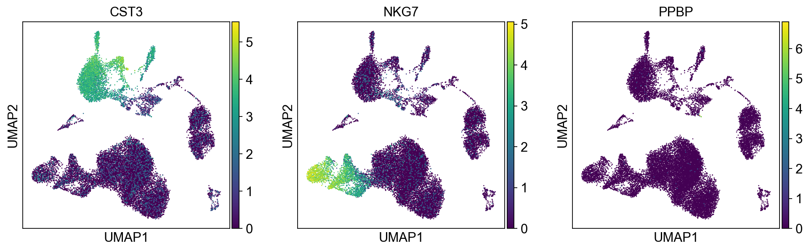
    


As we set the `.raw` attribute of `adata`, the previous plots showed the "raw" (normalized, logarithmized, but uncorrected) gene expression. You can also plot the scaled and corrected gene expression by explicitly stating that you don't want to use `.raw`.


```python
sc.pl.umap(adata, color=["CST3", "NKG7", "PPBP"], use_raw=False)
```


    
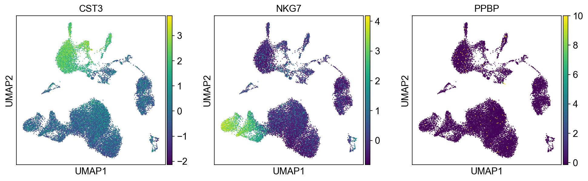
    


## Clustering the neighborhood graph

As with Seurat and many other frameworks, we recommend the Leiden graph-clustering method (community detection based on optimizing modularity) by [Traag *et al.* (2018)](https://scanpy.readthedocs.io/en/latest/references.html#traag18). Note that Leiden clustering directly clusters the neighborhood graph of cells, which we already computed in the previous section.


```python
sc.tl.leiden(
    adata,
    resolution=0.2,
    random_state=0,
    flavor="igraph",
    n_iterations=2,
    directed=False,
)
```

    running Leiden clustering
        finished: found 10 clusters and added
        'leiden', the cluster labels (adata.obs, categorical) (0:00:00)


Plot the clusters, which agree quite well with the result of Seurat.


```python
sc.pl.umap(adata, color=["leiden", "CST3", "NKG7"])
```


    
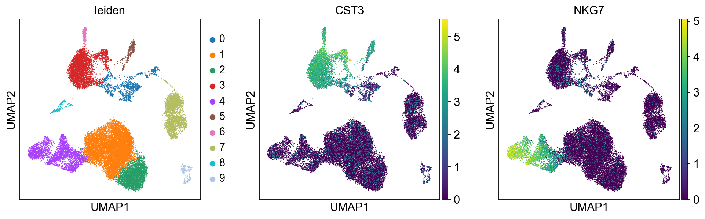
    


Save the result.


```python
adata.write(results_file)
```

## Finding marker genes

Let us compute a ranking for the highly differential genes in each cluster. For this, by default, the `.raw` attribute of AnnData is used in case it has been initialized before. The simplest and fastest method to do so is the t-test.


```python
sc.tl.rank_genes_groups(adata, "leiden", method="t-test")
sc.pl.rank_genes_groups(adata, n_genes=25, sharey=False)
```

    ranking genes
        finished: added to `.uns['rank_genes_groups']`
        'names', sorted np.recarray to be indexed by group ids
        'scores', sorted np.recarray to be indexed by group ids
        'logfoldchanges', sorted np.recarray to be indexed by group ids
        'pvals', sorted np.recarray to be indexed by group ids
        'pvals_adj', sorted np.recarray to be indexed by group ids (0:00:37)


    
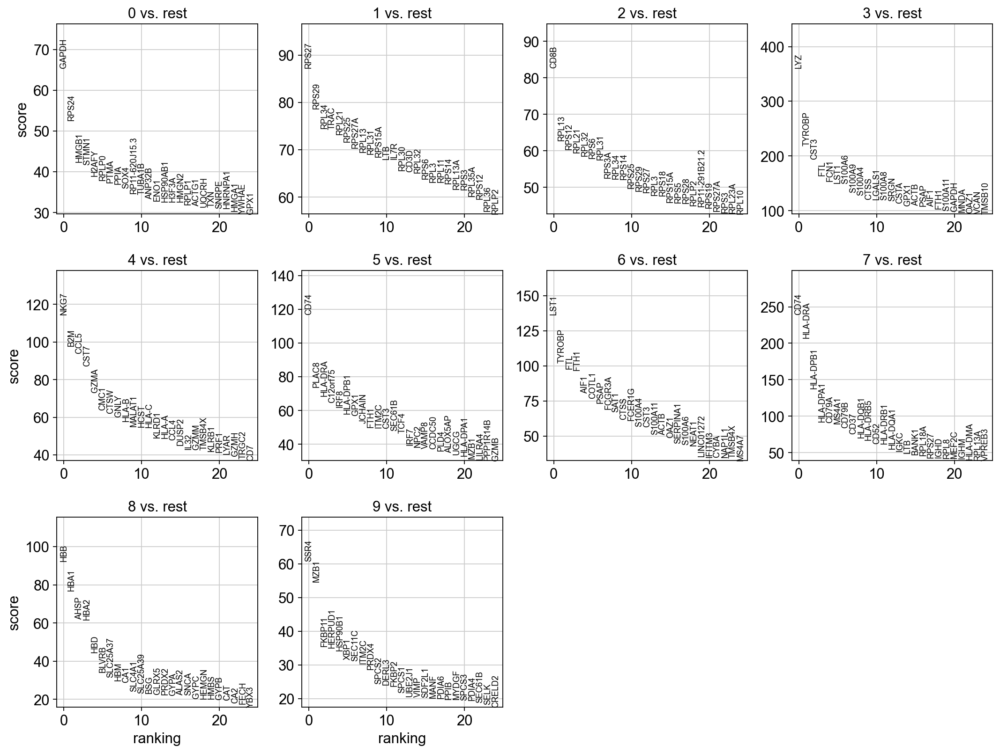
    


```python
sc.settings.verbosity = 2  # reduce the verbosity
```

The result of a [Wilcoxon rank-sum (Mann-Whitney-U)](https://en.wikipedia.org/wiki/Mann%E2%80%93Whitney_U_test) test is very similar. We recommend using the latter in publications, see e.g., [Sonison & Robinson (2018)](https://doi.org/10.1038/nmeth.4612). You might also consider much more powerful differential testing packages like MAST, limma, DESeq2 and, for python, the recent diffxpy.


```python
sc.tl.rank_genes_groups(adata, "leiden", method="wilcoxon")
sc.pl.rank_genes_groups(adata, n_genes=25, sharey=False)
```

    ranking genes
        finished (0:00:44)


    
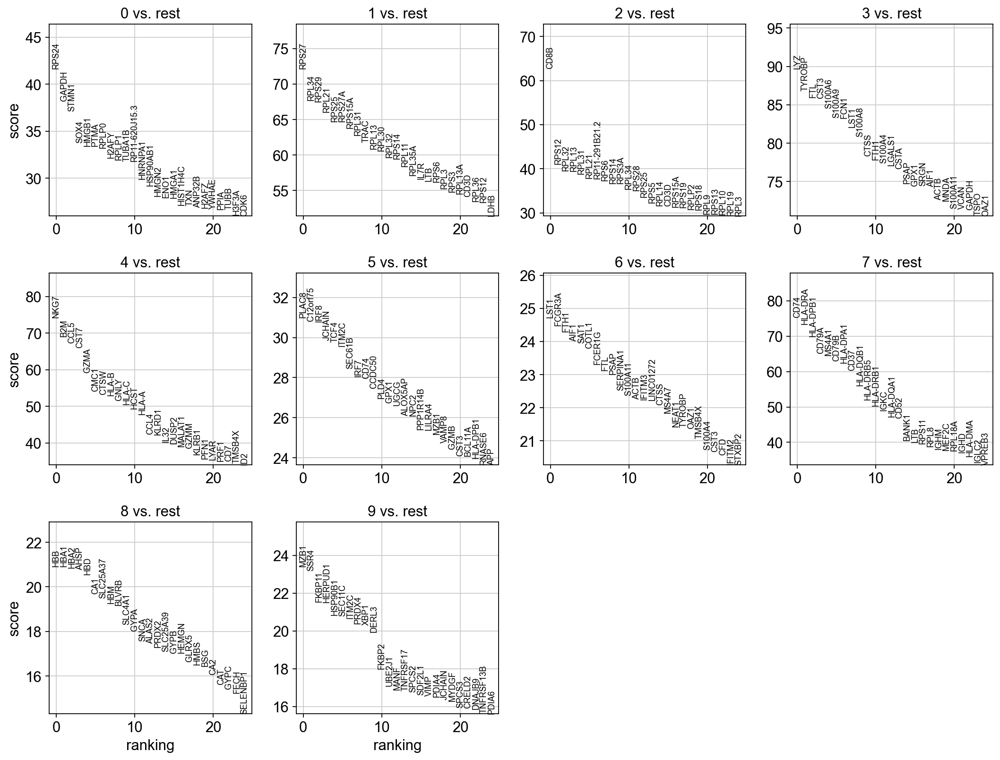
    


Save the result.


```python
adata.write(results_file)
```

As an alternative, let us rank genes using logistic regression. For instance, this has been suggested by [Natranos et al. (2018)](https://doi.org/10.1101/258566). The essential difference is that here, we use a multi-variate appraoch whereas conventional differential tests are uni-variate. [Clark et al. (2014)](https://doi.org/10.1186/1471-2105-15-79) has more details.


```python
sc.tl.rank_genes_groups(adata, "leiden", method="logreg", max_iter=1000)
sc.pl.rank_genes_groups(adata, n_genes=25, sharey=False)
```

    ranking genes
        finished (0:07:54)


    
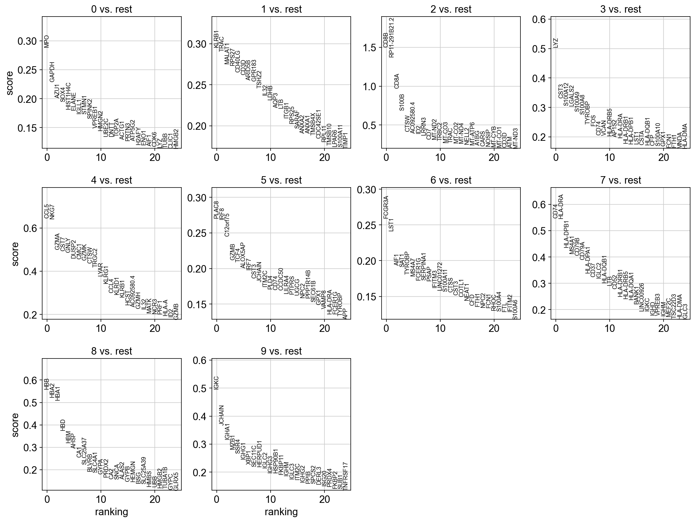
    


With the exceptions of *IL7R*, which is only found by the t-test and *FCER1A*, which is only found by the other two appraoches, all marker genes are recovered in all approaches.

Louvain Group | Markers | Cell Type
---|---|---
0 | IL7R | CD4 T cells
1 | CD14, LYZ | CD14+ Monocytes
2 | MS4A1 |	B cells
3 | CD8A |	CD8 T cells
4 | GNLY, NKG7 | 	NK cells
5 | FCGR3A, MS4A7 |	FCGR3A+ Monocytes
6 | FCER1A, CST3 |	Dendritic Cells
7 | PPBP |	Megakaryocytes

Let us also define a list of marker genes for later reference.


```python
marker_genes = [
    *["IL7R", "CD79A", "MS4A1", "CD8A", "CD8B", "LYZ", "CD14"],
    *["LGALS3", "S100A8", "GNLY", "NKG7", "KLRB1"],
    *["FCGR3A", "MS4A7", "FCER1A", "CST3", "PPBP"],
]
```

Reload the object that has been save with the Wilcoxon Rank-Sum test result.


```python
adata = sc.read(results_file)
```

Show the 10 top ranked genes per cluster 0, 1, ..., 7 in a dataframe.


```python
pd.DataFrame(adata.uns["rank_genes_groups"]["names"]).head(5)
```


<div>
<style scoped>
    .dataframe tbody tr th:only-of-type {
        vertical-align: middle;
    }

    .dataframe tbody tr th {
        vertical-align: top;
    }

    .dataframe thead th {
        text-align: right;
    }
</style>
<table border="1" class="dataframe">
  <thead>
    <tr style="text-align: right;">
      <th></th>
      <th>0</th>
      <th>1</th>
      <th>2</th>
      <th>3</th>
      <th>4</th>
      <th>5</th>
      <th>6</th>
      <th>7</th>
      <th>8</th>
      <th>9</th>
    </tr>
  </thead>
  <tbody>
    <tr>
      <th>0</th>
      <td>RPS24</td>
      <td>RPS27</td>
      <td>CD8B</td>
      <td>LYZ</td>
      <td>NKG7</td>
      <td>PLAC8</td>
      <td>LST1</td>
      <td>CD74</td>
      <td>HBB</td>
      <td>MZB1</td>
    </tr>
    <tr>
      <th>1</th>
      <td>GAPDH</td>
      <td>RPL34</td>
      <td>RPS12</td>
      <td>TYROBP</td>
      <td>B2M</td>
      <td>C12orf75</td>
      <td>FCGR3A</td>
      <td>HLA-DRA</td>
      <td>HBA1</td>
      <td>SSR4</td>
    </tr>
    <tr>
      <th>2</th>
      <td>STMN1</td>
      <td>RPS29</td>
      <td>RPL32</td>
      <td>FTL</td>
      <td>CCL5</td>
      <td>IRF8</td>
      <td>FTH1</td>
      <td>HLA-DPB1</td>
      <td>HBA2</td>
      <td>FKBP11</td>
    </tr>
    <tr>
      <th>3</th>
      <td>SOX4</td>
      <td>RPL21</td>
      <td>RPL13</td>
      <td>CST3</td>
      <td>CST7</td>
      <td>JCHAIN</td>
      <td>AIF1</td>
      <td>CD79A</td>
      <td>AHSP</td>
      <td>HERPUD1</td>
    </tr>
    <tr>
      <th>4</th>
      <td>HMGB1</td>
      <td>RPS25</td>
      <td>RPL31</td>
      <td>S100A6</td>
      <td>GZMA</td>
      <td>TCF4</td>
      <td>SAT1</td>
      <td>MS4A1</td>
      <td>HBD</td>
      <td>HSP90B1</td>
    </tr>
  </tbody>
</table>
</div>


Get a table with the scores and groups.


```python
result = adata.uns["rank_genes_groups"]
groups = result["names"].dtype.names
pd.DataFrame(
    {
        f"{group}_{key[:1]}": result[key][group]
        for group in groups
        for key in ["names", "pvals"]
    }
).head(5)
```


<div>
<style scoped>
    .dataframe tbody tr th:only-of-type {
        vertical-align: middle;
    }

    .dataframe tbody tr th {
        vertical-align: top;
    }

    .dataframe thead th {
        text-align: right;
    }
</style>
<table border="1" class="dataframe">
  <thead>
    <tr style="text-align: right;">
      <th></th>
      <th>0_n</th>
      <th>0_p</th>
      <th>1_n</th>
      <th>1_p</th>
      <th>2_n</th>
      <th>2_p</th>
      <th>3_n</th>
      <th>3_p</th>
      <th>4_n</th>
      <th>4_p</th>
      <th>5_n</th>
      <th>5_p</th>
      <th>6_n</th>
      <th>6_p</th>
      <th>7_n</th>
      <th>7_p</th>
      <th>8_n</th>
      <th>8_p</th>
      <th>9_n</th>
      <th>9_p</th>
    </tr>
  </thead>
  <tbody>
    <tr>
      <th>0</th>
      <td>RPS24</td>
      <td>0.000000e+00</td>
      <td>RPS27</td>
      <td>0.0</td>
      <td>CD8B</td>
      <td>0.0</td>
      <td>LYZ</td>
      <td>0.0</td>
      <td>NKG7</td>
      <td>0.0</td>
      <td>PLAC8</td>
      <td>4.285922e-211</td>
      <td>LST1</td>
      <td>5.149862e-135</td>
      <td>CD74</td>
      <td>0.0</td>
      <td>HBB</td>
      <td>3.080480e-97</td>
      <td>MZB1</td>
      <td>2.369193e-121</td>
    </tr>
    <tr>
      <th>1</th>
      <td>GAPDH</td>
      <td>0.000000e+00</td>
      <td>RPL34</td>
      <td>0.0</td>
      <td>RPS12</td>
      <td>0.0</td>
      <td>TYROBP</td>
      <td>0.0</td>
      <td>B2M</td>
      <td>0.0</td>
      <td>C12orf75</td>
      <td>1.679933e-208</td>
      <td>FCGR3A</td>
      <td>2.385667e-132</td>
      <td>HLA-DRA</td>
      <td>0.0</td>
      <td>HBA1</td>
      <td>3.187458e-97</td>
      <td>SSR4</td>
      <td>5.027135e-119</td>
    </tr>
    <tr>
      <th>2</th>
      <td>STMN1</td>
      <td>6.311645e-302</td>
      <td>RPS29</td>
      <td>0.0</td>
      <td>RPL32</td>
      <td>0.0</td>
      <td>FTL</td>
      <td>0.0</td>
      <td>CCL5</td>
      <td>0.0</td>
      <td>IRF8</td>
      <td>4.265873e-208</td>
      <td>FTH1</td>
      <td>2.165971e-130</td>
      <td>HLA-DPB1</td>
      <td>0.0</td>
      <td>HBA2</td>
      <td>1.457238e-96</td>
      <td>FKBP11</td>
      <td>5.183640e-103</td>
    </tr>
    <tr>
      <th>3</th>
      <td>SOX4</td>
      <td>5.626871e-250</td>
      <td>RPL21</td>
      <td>0.0</td>
      <td>RPL13</td>
      <td>0.0</td>
      <td>CST3</td>
      <td>0.0</td>
      <td>CST7</td>
      <td>0.0</td>
      <td>JCHAIN</td>
      <td>4.920712e-196</td>
      <td>AIF1</td>
      <td>1.694953e-127</td>
      <td>CD79A</td>
      <td>0.0</td>
      <td>AHSP</td>
      <td>9.032556e-96</td>
      <td>HERPUD1</td>
      <td>1.175024e-102</td>
    </tr>
    <tr>
      <th>4</th>
      <td>HMGB1</td>
      <td>3.704654e-245</td>
      <td>RPS25</td>
      <td>0.0</td>
      <td>RPL31</td>
      <td>0.0</td>
      <td>S100A6</td>
      <td>0.0</td>
      <td>GZMA</td>
      <td>0.0</td>
      <td>TCF4</td>
      <td>9.023827e-195</td>
      <td>SAT1</td>
      <td>8.542286e-127</td>
      <td>MS4A1</td>
      <td>0.0</td>
      <td>HBD</td>
      <td>5.115416e-94</td>
      <td>HSP90B1</td>
      <td>1.654717e-96</td>
    </tr>
  </tbody>
</table>
</div>


Compare to a single cluster: 


```python
sc.tl.rank_genes_groups(adata, "leiden", groups=["0"], reference="1", method="wilcoxon")
sc.pl.rank_genes_groups(adata, groups=["0"], n_genes=20)
```

    ranking genes
        finished (0:00:07)


    
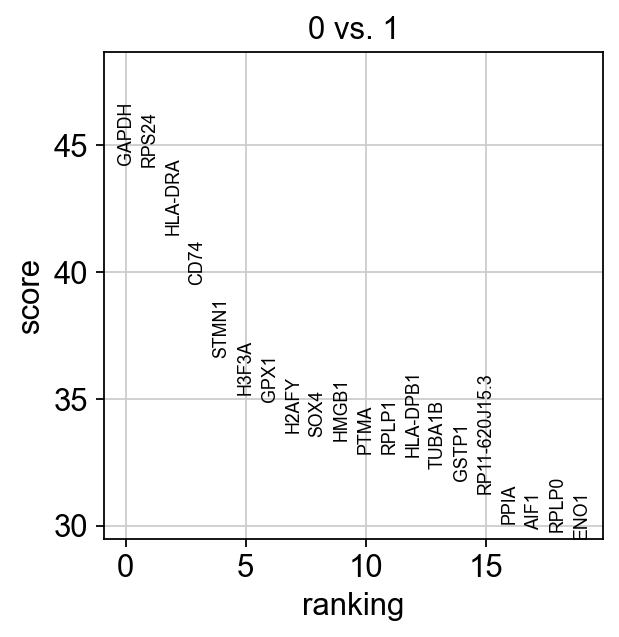
    


If we want a more detailed view for a certain group, use `sc.pl.rank_genes_groups_violin`.


```python
sc.pl.rank_genes_groups_violin(adata, groups="0", n_genes=8)
```

    /Users/venikkus/miniconda3/lib/python3.11/site-packages/scanpy/plotting/_tools/__init__.py:1324: UserWarning: set_ticklabels() should only be used with a fixed number of ticks, i.e. after set_ticks() or using a FixedLocator.
      _ax.set_xticklabels(new_gene_names, rotation="vertical")


    
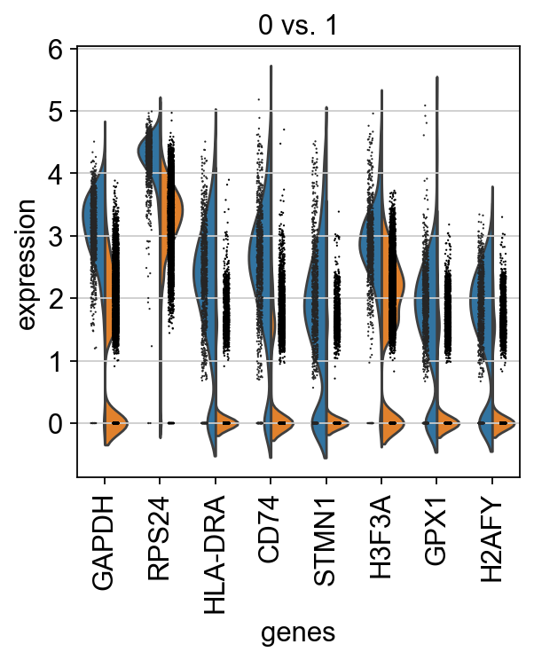
    


Reload the object with the computed differential expression (i.e. DE via a comparison with the rest of the groups):


```python
adata = sc.read(results_file)
```


```python
sc.pl.rank_genes_groups_violin(adata, groups="0", n_genes=8)
```

    /Users/venikkus/miniconda3/lib/python3.11/site-packages/scanpy/plotting/_tools/__init__.py:1324: UserWarning: set_ticklabels() should only be used with a fixed number of ticks, i.e. after set_ticks() or using a FixedLocator.
      _ax.set_xticklabels(new_gene_names, rotation="vertical")


    
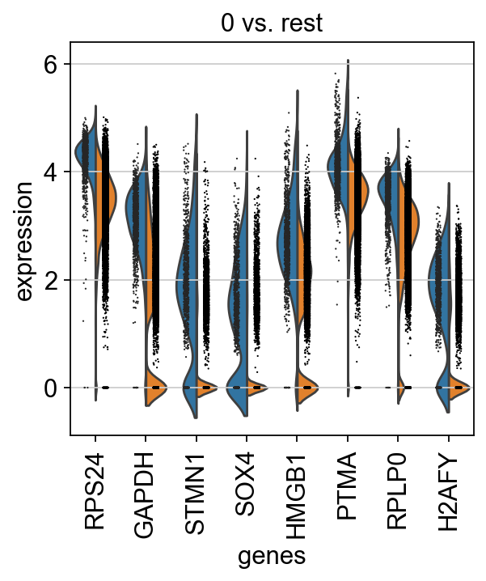
    


If you want to compare a certain gene across groups, use the following.


```python
sc.pl.violin(adata, ["CST3", "NKG7", "PPBP"], groupby="leiden")
```


    
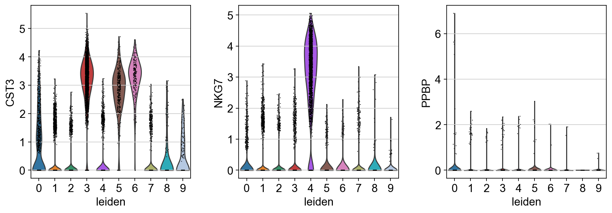
    


Actually mark the cell types.


```python
adata
```


    AnnData object with n_obs × n_vars = 21839 × 1063
        obs: 'n_genes', 'n_genes_by_counts', 'total_counts', 'total_counts_mt', 'pct_counts_mt', 'leiden'
        var: 'n_cells', 'mt', 'n_cells_by_counts', 'mean_counts', 'pct_dropout_by_counts', 'total_counts', 'highly_variable', 'means', 'dispersions', 'dispersions_norm', 'mean', 'std'
        uns: 'hvg', 'leiden', 'leiden_colors', 'log1p', 'neighbors', 'pca', 'rank_genes_groups', 'umap'
        obsm: 'X_pca', 'X_umap'
        varm: 'PCs'
        obsp: 'connectivities', 'distances'


```python
import celltypist
from celltypist import models
```


```python
# до нормализации:
adata.layers["counts"] = adata.X.copy()

# потом нормализуем:
sc.pp.normalize_total(adata, target_sum=1e4)
sc.pp.log1p(adata)
```

    normalizing counts per cell
        finished (0:00:00)
    WARNING: adata.X seems to be already log-transformed.


```python
adata_celltypist = adata.copy()  # make a copy of our adata
adata_celltypist.X = adata.layers["counts"]  # set adata.X to raw counts
sc.pp.normalize_total(
    adata_celltypist, target_sum=10**4
)  # normalize to 10,000 counts per cell
sc.pp.log1p(adata_celltypist)  # log-transform
# make .X dense instead of sparse, for compatibility with celltypist:

type(adata.X)
```

    normalizing counts per cell
        finished (0:00:00)
    WARNING: adata.X seems to be already log-transformed.


    numpy.ndarray


```python
models.download_models(
    force_update=True, model=["Immune_All_Low.pkl", "Immune_All_High.pkl"]
)
```

    📜 Retrieving model list from server https://celltypist.cog.sanger.ac.uk/models/models.json
    📚 Total models in list: 54
    📂 Storing models in /Users/venikkus/.celltypist/data/models
    💾 Total models to download: 2
    💾 Downloading model [1/2]: Immune_All_Low.pkl
    💾 Downloading model [2/2]: Immune_All_High.pkl


```python
model_low = models.Model.load(model="Immune_All_Low.pkl")
model_high = models.Model.load(model="Immune_All_High.pkl")
```


```python
model_high.cell_types
```


    array(['B cells', 'B-cell lineage', 'Cycling cells', 'DC', 'DC precursor',
           'Double-negative thymocytes', 'Double-positive thymocytes', 'ETP',
           'Early MK', 'Endothelial cells', 'Epithelial cells',
           'Erythrocytes', 'Erythroid', 'Fibroblasts', 'Granulocytes',
           'HSC/MPP', 'ILC', 'ILC precursor', 'MNP', 'Macrophages',
           'Mast cells', 'Megakaryocyte precursor',
           'Megakaryocytes/platelets', 'Mono-mac', 'Monocyte precursor',
           'Monocytes', 'Myelocytes', 'Plasma cells', 'Promyelocytes',
           'T cells', 'pDC', 'pDC precursor'], dtype=object)


```python
model_low.cell_types
```


    array(['Age-associated B cells', 'Alveolar macrophages', 'B cells',
           'CD16+ NK cells', 'CD16- NK cells', 'CD8a/a', 'CD8a/b(entry)',
           'CMP', 'CRTAM+ gamma-delta T cells', 'Classical monocytes',
           'Cycling B cells', 'Cycling DCs', 'Cycling NK cells',
           'Cycling T cells', 'Cycling gamma-delta T cells',
           'Cycling monocytes', 'DC', 'DC precursor', 'DC1', 'DC2', 'DC3',
           'Double-negative thymocytes', 'Double-positive thymocytes', 'ELP',
           'ETP', 'Early MK', 'Early erythroid', 'Early lymphoid/T lymphoid',
           'Endothelial cells', 'Epithelial cells', 'Erythrocytes',
           'Erythrophagocytic macrophages', 'Fibroblasts',
           'Follicular B cells', 'Follicular helper T cells', 'GMP',
           'Germinal center B cells', 'Granulocytes', 'HSC/MPP',
           'Hofbauer cells', 'ILC', 'ILC precursor', 'ILC1', 'ILC2', 'ILC3',
           'Intermediate macrophages', 'Intestinal macrophages',
           'Kidney-resident macrophages', 'Kupffer cells',
           'Large pre-B cells', 'Late erythroid', 'MAIT cells', 'MEMP', 'MNP',
           'Macrophages', 'Mast cells', 'Megakaryocyte precursor',
           'Megakaryocyte-erythroid-mast cell progenitor',
           'Megakaryocytes/platelets', 'Memory B cells',
           'Memory CD4+ cytotoxic T cells', 'Mid erythroid', 'Migratory DCs',
           'Mono-mac', 'Monocyte precursor', 'Monocytes', 'Myelocytes',
           'NK cells', 'NKT cells', 'Naive B cells',
           'Neutrophil-myeloid progenitor', 'Neutrophils',
           'Non-classical monocytes', 'Plasma cells', 'Plasmablasts',
           'Pre-pro-B cells', 'Pro-B cells',
           'Proliferative germinal center B cells', 'Promyelocytes',
           'Regulatory T cells', 'Small pre-B cells', 'T(agonist)',
           'Tcm/Naive cytotoxic T cells', 'Tcm/Naive helper T cells',
           'Tem/Effector helper T cells', 'Tem/Effector helper T cells PD1+',
           'Tem/Temra cytotoxic T cells', 'Tem/Trm cytotoxic T cells',
           'Transitional B cells', 'Transitional DC', 'Transitional NK',
           'Treg(diff)', 'Trm cytotoxic T cells', 'Type 1 helper T cells',
           'Type 17 helper T cells', 'gamma-delta T cells', 'pDC',
           'pDC precursor'], dtype=object)


```python
import numpy as np

adata_celltypist.X = np.nan_to_num(adata.X)

if not isinstance(adata_celltypist.X, np.ndarray):
    adata_celltypist.X = adata_celltypist.X.toarray()
    adata_celltypist.X = np.nan_to_num(adata_celltypist.X)
```


```python
predictions_high = celltypist.annotate(
    adata_celltypist, model=model_high, majority_voting=True
)
```

    👀 Invalid expression matrix in `.X`, expect log1p normalized expression to 10000 counts per cell; will use `.raw.X` instead
    🔬 Input data has 21839 cells and 17008 genes
    🔗 Matching reference genes in the model
    🧬 5007 features used for prediction
    ⚖️ Scaling input data
    🖋️ Predicting labels
    ✅ Prediction done!
    👀 Detected a neighborhood graph in the input object, will run over-clustering on the basis of it
    ⛓️ Over-clustering input data with resolution set to 15


    running Leiden clustering
        finished (0:00:10)


    🗳️ Majority voting the predictions
    ✅ Majority voting done!


```python
predictions_high_adata = predictions_high.to_adata()
```


```python
adata.obs["celltypist_cell_label_coarse"] = predictions_high_adata.obs.loc[
    adata.obs.index, "majority_voting"
]
adata.obs["celltypist_conf_score_coarse"] = predictions_high_adata.obs.loc[
    adata.obs.index, "conf_score"
]
```


```python
sc.pl.umap(
    adata,
    color=["celltypist_cell_label_coarse", "celltypist_conf_score_coarse"],
    frameon=False,
    sort_order=False,
    wspace=1,
    save=False,
    show=False
)
plt.savefig("umap.png", dpi=300, bbox_inches="tight")
```


    
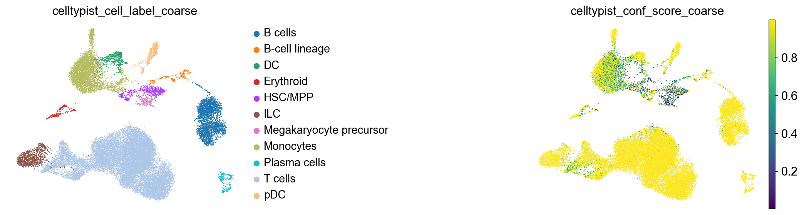
    


Now that we annotated the cell types, let us visualize the marker genes.


```python
sc.pl.dotplot(adata, marker_genes, groupby="celltypist_cell_label_coarse", show=False);
plt.savefig("dotplot.png", dpi=300, bbox_inches="tight")
```


    
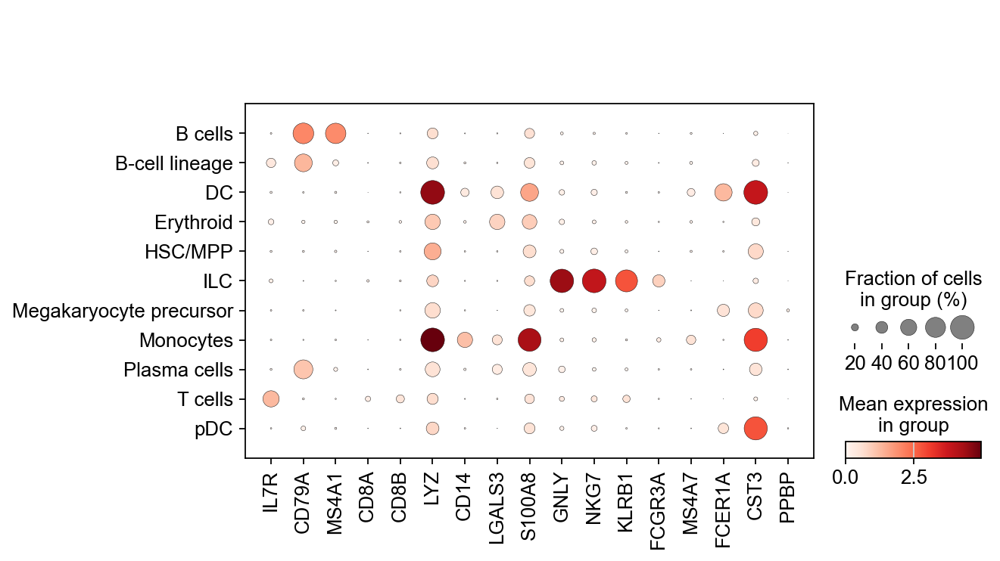
    


There is also a very compact violin plot.


```python
sc.pl.stacked_violin(adata, marker_genes, groupby="celltypist_cell_label_coarse");
```


    
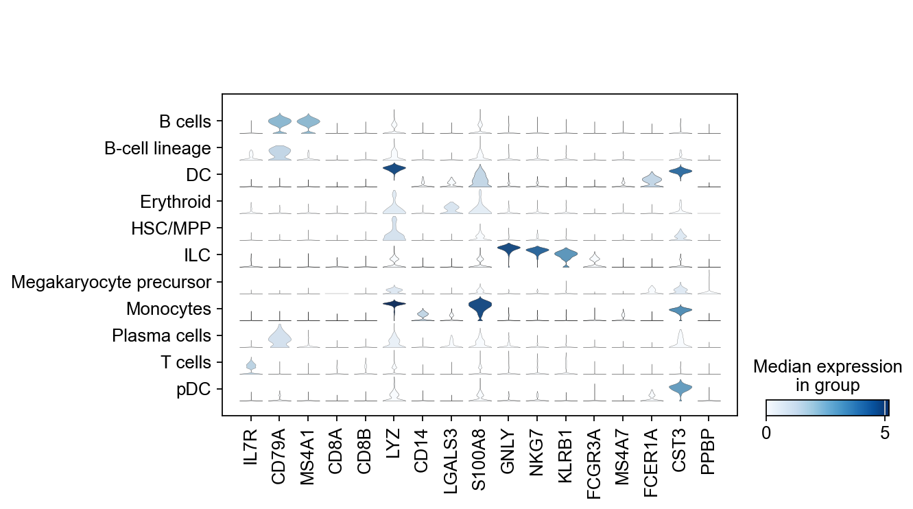
    


```python
sc.pl.dendrogram(adata, groupby="celltypist_cell_label_coarse")
```

    WARNING: dendrogram data not found (using key=dendrogram_celltypist_cell_label_coarse). Running `sc.tl.dendrogram` with default parameters. For fine tuning it is recommended to run `sc.tl.dendrogram` independently.
        using 'X_pca' with n_pcs = 50
    Storing dendrogram info using `.uns['dendrogram_celltypist_cell_label_coarse']`


    
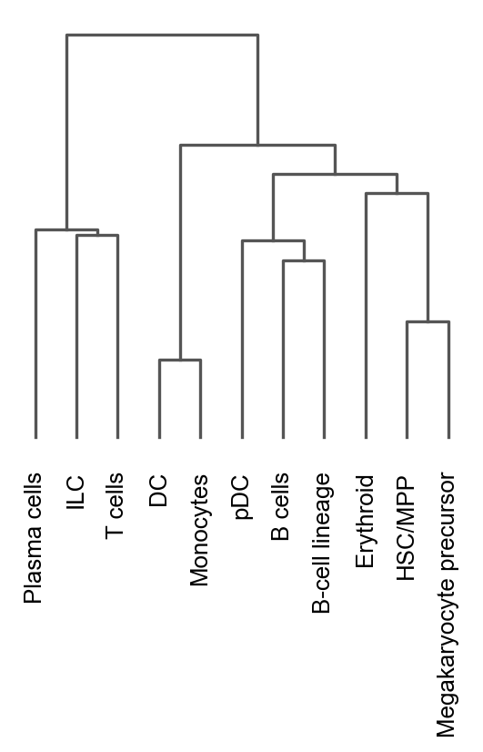
    


    <Axes: >


During the course of this analysis, the AnnData accumlated the following annotations.


```python
adata
```


    AnnData object with n_obs × n_vars = 21839 × 1063
        obs: 'n_genes', 'n_genes_by_counts', 'total_counts', 'total_counts_mt', 'pct_counts_mt', 'leiden', 'celltypist_cell_label_coarse', 'celltypist_conf_score_coarse'
        var: 'n_cells', 'mt', 'n_cells_by_counts', 'mean_counts', 'pct_dropout_by_counts', 'total_counts', 'highly_variable', 'means', 'dispersions', 'dispersions_norm', 'mean', 'std'
        uns: 'hvg', 'leiden', 'leiden_colors', 'log1p', 'neighbors', 'pca', 'rank_genes_groups', 'umap', 'celltypist_cell_label_coarse_colors', 'dendrogram_celltypist_cell_label_coarse'
        obsm: 'X_pca', 'X_umap'
        varm: 'PCs'
        layers: 'counts'
        obsp: 'connectivities', 'distances'


```python
# `compression='gzip'` saves disk space, and slightly slows down writing and subsequent reading
adata.write(results_file, compression="gzip")
```

Get a rough overview of the file using `h5ls`, which has many options - for more details see [here](https://github.com/theislab/scanpy_usage/blob/master/170505_seurat/info_h5ad.md). The file format might still be subject to further optimization in the future. All reading functions will remain backwards-compatible, though.

If you want to share this file with people who merely want to use it for visualization, a simple way to reduce the file size is by removing the dense scaled and corrected data matrix. The file still contains the raw data used in the visualizations in `adata.raw`.


```python
adata.raw.to_adata().write("./write/pbmc3k_withoutX.h5ad")
```
